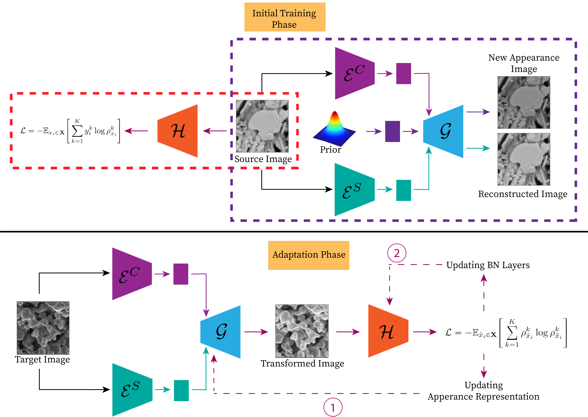

# Improving Model Robustness Against Variations in Micrograph Quality with Unsupervised Domain Adaptation

This is an official implementation of the paper ["Improving Model Robustness Against Variations in Micrograph Quality with Unsupervised Domain Adaptation"](to be added).
<p align="center">
  
</p>


## Setup
### Prerequisites
- Linux
- NVIDIA GPU (with at least 12GB of memory) + CUDA CuDNN (CPU mode may work without any modification, but untested)
- Python 3.6

### Installation
- Clone the repository
```
git clone to_be_added
cd SEM-UDASS
```
- Install required libraries with
```
pip3 install -r requirements.txt --find-links https://download.pytorch.org/whl/torch_stable.html
```

### Data Preparation
- To run the model with your own dataset, you need to create two subdirectories inside the dataset folder with one for source domain dataset and one for target domain dataset. Otherwise, line 52-56 in ``style_sem.py`` file need to be modified accordingly for training the appearance transformation model.

## Model Execution
Follow the specification of parameters below to train or performance inference using the `Appearance Transformation Model` or `Classification Model [MISO|MLP-VQVAE]` or your own downstream task model under desired behaviors. Examples of training/testing specifications using `MISO` and `MLP-VQVAE` classification model can be found in the `scripts` folder. Moreover, the `train_multi_mags.txt` and `val_multi_mags.txt` illustrate how we organized training and test samples into text files that are used to perform experiments described in the paper.

### Appearance Transformation Model
```
python style_manipulation.py *args*
```

- `gpu_id` - Specify the GPU# to run the model on
- `dataset` - Specify the dataset. For a customized dataset, a new condition and dataset class need to be added to `style_manipulation.py` file
- `train_dir` - Root directory of *train* (source) dataset
- `test_dir` - Root directory of *test* (target) dataset
- `sub_dir` - Sub directory if the dataset is further categorized into various subfolders
- `config_file` - Name of config file that stores necessary parameters of the appearance transformation model
- `exp_name` - Name of current experiment
- `stage` - Execution stage [train|test|viz]
- `checkpoint_dir` - Directory for storing checkpoint
- `checkpoint` - Checkpoint to be restored
- `gen_dir` - Directory for storing generated images
- `num_styles` - Number of random styles to be generated for each sample

### Downstream Task Model
```
python exps.py *args*
```

- `gpu_id` - Specify the GPU# to run the model on
- `exp_name` - Name of current experiment
- `dataset` - Specify the dataset type. For a customized dataset, a new condition and dataset class need to be added to `exp.py` file
- `train_dir` - Root directory of *train* (source) dataset
- `val_dir` - Root directory of *val* (source) dataset
- `target_train_dir` - Root directory of *adapt* (target) dataset
- `test_dir` - Root directory of *test* (target) dataset
- `config_file` - Name of config file that stores necessary parameters for the downstream task model
- `seed` - [Optional] Specify the predefined seed number for random split of *train*/*val* or *adapt*/*test* files
- `stage` - Execution stage [train/test]
- `adapt_type` - Adaptation method during inference [na|tent|hm|wct|app|hm_tent|wct_tent|app_tent]. Please see `inference` function in `seg_model.py` for more information
- `saved_model_dir` - Directory of the saved downstream task model
- `style_config_file` - Name of config file for the appearance transformation model used in the adaptation phase
- `style_checkpoint_file` - Checkpoint of the appearance transformation model to be restored
- `vqvae_config_file` - Name of config file for the MLP-VQVAE downstream task model
- `vqvae_checkpoint_dir` - Directory of the saved MLP-VQVAE model

## Representative Examples
A few representative examples of the dataset used in this study can be located inside `sem_datasets` folder.

## Acknowledgements
This implementation is benefited greatly from the publicly available codes from [MUNIT](https://github.com/NVlabs/MUNIT) and [MISO](https://github.com/nly8292/MISO.git).

## Citation
If you find this code useful for your research, please cite our paper:
    @article{uda-ss,
    title={to_be_added}
    }
